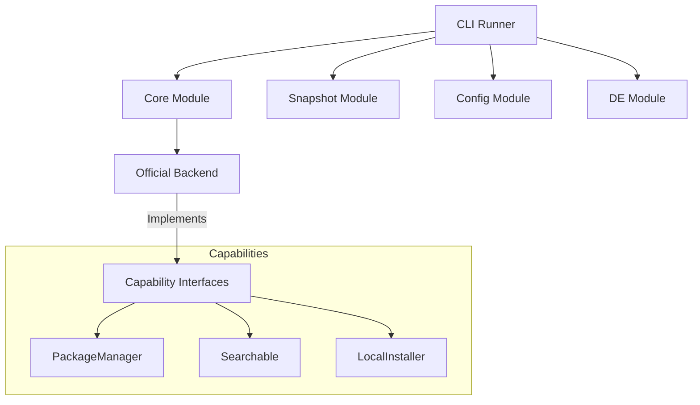

<p align="center">
  <h1 align="center">shedman</h1>
  <p align="center">
    <strong>The next-generation modular package manager for Arch Linux and ShedOS</strong>
  </p>
  <p align="center">
    <a href="#features">Features</a> •
    <a href="#installation">Installation</a> •
    <a href="#usage">Usage</a> •
    <a href="#architecture">Architecture</a> •
    <a href="#documentation">Documentation</a> •
    <a href="#contributing">Contributing</a>
  </p>
</p>

---

## Vision

> **"You should never have to think twice before reformatting your computer."**

**shedman** is a modern, modular package manager designed specifically for **Arch-based Linux distributions** (ShedOS, Arch Linux, Manjaro, EndeavourOS).

It goes beyond traditional package management by integrating system snapshots, configuration management, and desktop environment switching into a single, cohesive tool.

### Core Principles

1. **Arch-Native**: Built on `go-alpm` and designed exclusively for the Arch ecosystem.
2. **Modular Design**: Composed of distinct, swappable modules (core, snapshot, config, etc.).
3. **100% Pacman Compatible**: A drop-in replacement for all `pacman` commands and configuration.
4. **Resilient**: Integrated system snapshots ensure you can always roll back.
5. **Declarative**: Manage your entire system state (packages, configs, themes) as code.

---

## Features

### 📦 Modular Architecture

Unlike monolithic package managers, shedman is built from 12 specialized modules:

| Module | Responsibility | Key Commands |
| :--- | :--- | :--- |
| **core** | Package management | `install`, `remove`, `update`, `search`, `info` |
| **snapshot** | System backups | `snapshot create`, `restore`, `push` |
| **config** | Config packages | `config install`, `update` |
| **de** | Desktop environments | `de switch`, `list` |
| **theme** | Theming | `theme apply` |
| **svc** | Service management | `svc enable`, `start`, `status` |
| **boot** | Kernel/Bootloader | `boot set-default` |
| **security** | Vulnerability scanning | `security check` |

### 🚀 Key Capabilities

- **Pacman Compatibility**: Use `shedman -Syu`, `shedman -Rns`, etc. just like pacman.
- **Intelligent Snapshots**: Automatically snapshot before updates or risky operations.
- **Cloud Sync**: Push snapshots to R2, S3, or Google Drive for off-site backup.
- **Desktop Switching**: Switch between GNOME, KDE, Hyprland, and COSMIC with one command.
- **AUR Integration**: Transparently handle AUR packages (sandboxed builds).
- **Service Wrapper**: Manage systemd services with a simpler syntax (`shedman svc`).

---

## Installation

### From Source

```bash
# Clone the repository
git clone https://github.com/theshedman/shedman.git
cd shedman

# Build
go build -o shedman ./cmd/shedman

# Install
sudo mv shedman /usr/bin/
```

### From Go

```bash
go install github.com/theshedman/shedman/cmd/shedman@latest
```

---

## Usage

### Core Package Management

shedman supports all standard pacman syntax:

```bash
# Sync and update system
shedman sync
# OR
shedman -Syu

# Install packages (official or AUR)
shedman install neovim firefox
# OR
shedman -S neovim firefox

# Remove packages
shedman remove firefox
# OR
shedman -Rns firefox

# Search
shedman search "vim"
# OR
shedman -Ss "vim"
```

### Snapshots

Manage Btrfs/ZFS/Rsync snapshots directly:

```bash
# Create a named snapshot
shedman snapshot create --name "pre-update"

# List snapshots
shedman snapshot list

# Restore from a snapshot
shedman snapshot restore <snapshot-id>

# Push to cloud storage
shedman snapshot push <snapshot-id> --remote s3
```

### Service Management (svc)

Simplified systemd wrapper:

```bash
# Enable and start a service
shedman svc enable docker --now

# Check status
shedman svc status docker

# List all running services
shedman svc list
```

### Desktop Environment Switching

Seamlessly switch entire desktop environments:

```bash
# List available environments
shedman de list

# Switch to Hyprland
shedman de switch hyprland
```

### Building Packages

Build packages from PKGBUILDs (Arch native):

```bash
# Build package in current directory
shedman build .

# Build and install
shedman build . --install
```

---

## Architecture

shedman uses a **capability-based modular architecture**. Each module exposes specific interfaces that the core runner consumes.



For detailed architectural documentation, see:

- [**Modular Architecture**](docs/modular_architecture.md): Detailed breakdown of modules.
- [**Capability Interfaces**](docs/capability_interfaces.md): Go interface definitions.
- [**Architecture Decisions**](docs/architecture_decision_records.md): History of key design choices.
- [**Shed Format Spec**](docs/shed_format_specification.md): (Future) Specification for ShedOS universal packages.

## shedrepo

Shedman packages are hosted on **repo.shedos.org**, backed by Cloudflare R2.
Resolution priority: **ShedOS Repo** → **Arch Official** → **AUR**.

---

## Contributing

We welcome contributions! Please follow the [Standard Go Project Layout](https://github.com/golang-standards/project-layout).

1. **Fork** the repository.
2. **Create a branch** for your feature (`git checkout -b feature/amazing-feature`).
3. **Commit** your changes (`git commit -m 'feat: Add amazing feature'`).
4. **Push** to the branch (`git push origin feature/amazing-feature`).
5. **Open a Pull Request**.

### Testing

Run the full test suite:

```bash
go test ./... -v
```

---

## License

Distributed under the **GNU General Public License v3.0**. See `LICENSE` for more information.

<p align="center">
  Made with ❤️ for the Arch Linux community
</p>
