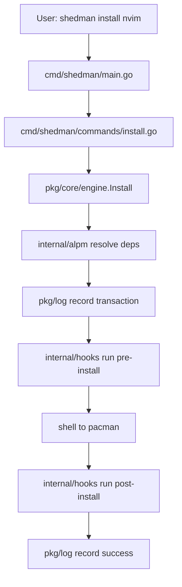
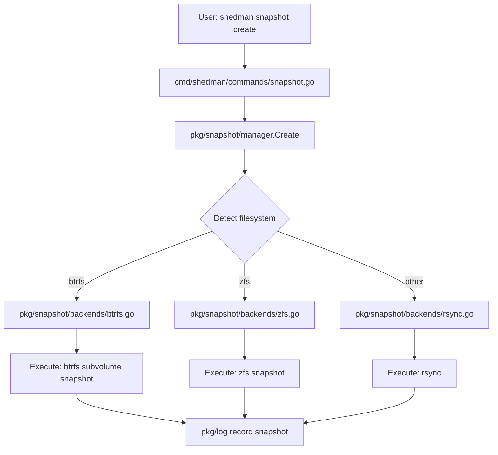
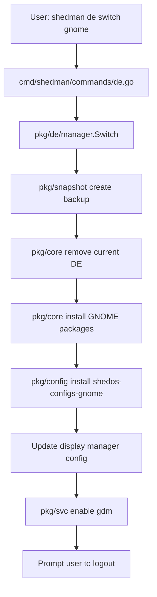

# ShedMan Modular Architecture Specification

## Overview

shedman follows a **modular monorepo** architecture where distinct functional modules compose into a single unified CLI tool. This provides clean separation of concerns while delivering a cohesive user experience.

### Architecture Principles

1. **Separation of Concerns**: Each module has a single, well-defined responsibility
2. **Loose Coupling**: Modules interact through well-defined interfaces
3. **High Cohesion**: Related functionality grouped together
4. **Single Binary**: Users get one executable (`shedman`)
5. **Unified CLI**: Consistent command structure across modules

---

## Repository Structure

```
shedman/
├── cmd/
│   └── shedman/
│       ├── main.go                 # Entry point, CLI router
│       └── commands/               # Command implementations
│           ├── install.go
│           ├── snapshot.go
│           └── ...
│
├── pkg/                           # Public packages (modules)
│   ├── core/                      # Core package management
│   │   ├── engine.go
│   │   ├── resolver.go
│   │   └── installer.go
│   │
│   ├── snapshot/                  # Backup/restore system
│   │   ├── snapshot.go
│   │   ├── backends/
│   │   │   ├── btrfs.go
│   │   │   ├── zfs.go
│   │   │   └── rsync.go
│   │   └── remote/
│   │       └── rclone.go
│   │
│   ├── config/                    # Configuration packages
│   │   ├── manager.go
│   │   └── packages/
│   │
│   ├── de/                        # Desktop environment
│   │   ├── switcher.go
│   │   └── profiles/
│   │
│   ├── theme/                     # Theme management
│   │   ├── manager.go
│   │   └── applier.go
│   │
│   ├── boot/                      # Boot management
│   │   ├── manager.go
│   │   └── kernels.go
│   │
│   ├── svc/                       # Service management
│   │   ├── manager.go
│   │   └── systemd.go
│   │
│   ├── notifier/                  # Update notifications
│   │   ├── notifier.go
│   │   └── daemon.go
│   │
│   ├── mirror/                    # Mirror management
│   │   ├── manager.go
│   │   └── tester.go
│   │
│   ├── log/                       # Logging system
│   │   ├── logger.go
│   │   └── transaction.go
│   │
│   ├── tui/                       # Terminal UI
│   │   ├── app.go
│   │   └── components/
│   │
│   ├── keyring/                   # GPG keyring
│   │   ├── manager.go
│   │   └── keys.go
│   │
│   └── security/                  # Security/CVE checking
│       ├── scanner.go
│       └── advisories.go
│
├── internal/                      # Private packages (shared utilities)
│   ├── alpm/                      # go-alpm wrapper
│   │   ├── handle.go
│   │   └── package.go
│   │
│   ├── config/                    # Config file parsing
│   │   ├── parser.go
│   │   └── pacman.go
│   │
│   ├── output/                    # Pretty printing
│   │   ├── format.go
│   │   └── progress.go
│   │
│   ├── hooks/                     # Hook system
│   │   └── runner.go
│   │
│   └── util/                      # Common utilities
│       ├── fs.go
│       └── exec.go
│
├── configs/                       # Example configurations
│   └── shedman.toml.example
│
├── docs/                          # Documentation
│   └── README.md
│
├── test/                          # Integration tests
│   ├── e2e/
│   └── fixtures/
│
├── go.mod
├── go.sum
├── Makefile
└── README.md
```

---

## Module Descriptions

### 1. pkg/core - Core Package Management

**Responsibility**: Package installation, removal, updates, searches

**Key Components:**

```go
package core

// Engine orchestrates package operations
type Engine struct {
    backend  backend.PackageManager
    resolver *Resolver
    logger   *log.Logger
}

func (e *Engine) Install(pkgs []string, opts InstallOptions) error
func (e *Engine) Remove(pkgs []string, opts RemoveOptions) error
func (e *Engine) Update(pkgs []string, opts UpdateOptions) error
func (e *Engine) Search(query string) ([]PackageInfo, error)
func (e *Engine) Info(pkg string) (*PackageInfo, error)
```

**Dependencies:**

- `internal/alpm` - libalpm bindings
- `internal/config` - Configuration parsing
- `internal/output` - Output formatting
- `pkg/log` - Transaction logging

---

### 2. pkg/snapshot - Backup/Restore System

**Responsibility**: System snapshots and restoration

**Key Components:**

```go
package snapshot

// Manager handles snapshot operations
type Manager struct {
    backend SnapshotBackend
    remote  RemoteBackend
}

// SnapshotBackend adapts to filesystem
type SnapshotBackend interface {
    Create(name string, opts CreateOptions) error
    List() ([]Snapshot, error)
    Restore(id string) error
    Delete(id string) error
}

// Filesystem-specific backends
type BtrfsBackend struct { ... }
type ZfsBackend struct { ... }
type RsyncBackend struct { ... }
```

**Dependencies:**

- `internal/util` - Filesystem detection
- External tools: `btrfs`, `zfs`, `rsync`, `rclone`

---

### 3. pkg/config - Configuration Package Management

**Responsibility**: Manage configuration packages (not dotfiles, actual packages)

**Key Components:**

```go
package config

// Manager handles config packages
type Manager struct {
    core *core.Engine
}

// Config packages are real pacman packages
// Example: shedos-configs-hyprland.pkg.tar.zst

func (m *Manager) List() ([]ConfigPackage, error)
func (m *Manager) Install(name string) error
func (m *Manager) Remove(name string) error
func (m *Manager) Update(name string) error
```

**Dependencies:**

- `pkg/core` - Package operations

**Note**: Config packages are standard Arch packages containing configuration files, managed like any other package.

---

### 4. pkg/de - Desktop Environment

**Responsibility**: Switch between desktop environments

**Key Components:**

```go
package de

type Manager struct {
    core *core.Engine
}

type DesktopEnvironment struct {
    Name         string
    Packages     []string
    DisplayMgr   string  // gdm, sddm, lightdm
    ConfigPkg    string  // shedos-configs-gnome
}

func (m *Manager) List() ([]DesktopEnvironment, error)
func (m *Manager) Switch(name string, opts SwitchOptions) error
func (m *Manager) Current() (*DesktopEnvironment, error)
```

**Dependencies:**

- `pkg/core` - Install/remove DE packages
- `pkg/snapshot` - Pre-switch snapshots (optional)

---

### 5. pkg/theme - Theme Management

**Responsibility**: System-wide theme installation and switching

**Key Components:**

```go
package theme

type Manager struct {
    core *core.Engine
}

type Theme struct {
    Name         string
    Package      string  // Package name
    Type         string  // gtk, kvantum, icon, cursor
    Applications []string  // Apps this theme supports
}

func (m *Manager) List() ([]Theme, error)
func (m *Manager) Install(name string) error
func (m *Manager) Apply(name string) error  // Set as active theme
func (m *Manager) Current() (*Theme, error)
```

**Dependencies:**

- `pkg/core` - Install theme packages

---

### 6. pkg/boot - Boot Management

**Responsibility**: Kernel management, bootloader configuration

**Key Components:**

```go
package boot

type Manager struct {
    bootloader Bootloader  // systemd-boot or grub
}

type Bootloader interface {
    ListKernels() ([]Kernel, error)
    SetDefault(kernel string) error
    SetOneshot(kernel string) error
}

type Kernel struct {
    Name    string
    Version string
    Path    string
    Current bool
}

func (m *Manager) List() ([]Kernel, error)
func (m *Manager) SetDefault(kernel string) error
```

**Dependencies:**

- `internal/util` - File operations

---

### 7. pkg/svc - Service Management

**Responsibility**: Systemd service management

**Key Components:**

```go
package svc

type Manager struct {
    systemd *SystemdClient
}

type Service struct {
    Name    string
    Enabled bool
    Active  bool
    Package string  // Package that provides this service
}

func (m *Manager) List(pkg string) ([]Service, error)
func (m *Manager) Enable(name string) error
func (m *Manager) Start(name string) error
func (m *Manager) Status(name string) (*ServiceStatus, error)
```

**Dependencies:**

- External: `systemctl`

---

### 8. pkg/notifier - Update Notifications

**Responsibility**: Notify users of available updates

**Key Components:**

```go
package notifier

type Notifier struct {
    core   *core.Engine
    config *Config
}

func (n *Notifier) Check() ([]Update, error)
func (n *Notifier) Notify(updates []Update) error
func (n *Notifier) EnableTimer() error  // systemd timer
func (n *Notifier) DisableTimer() error
```

**Dependencies:**

- `pkg/core` - Check for updates
- External: `notify-send`

---

### 9. pkg/mirror - Mirror Management

**Responsibility**: Manage pacman mirrors, test speeds

**Key Components:**

```go
package mirror

type Manager struct {
    configPath string  // /etc/pacman.d/mirrorlist
}

type Mirror struct {
    URL     string
    Country string
    Speed   time.Duration  // Latency
}

func (m *Manager) List() ([]Mirror, error)
func (m *Manager) Test() ([]Mirror, error)  // Speed test
func (m *Manager) Select(fastest int) error  // Set fastest N
```

**Dependencies:**

- `internal/config` - Parse mirrorlist

---

### 10. pkg/log - Logging System

**Responsibility**: Transaction logging, audit trail

**Key Components:**

```go
package log

type Logger struct {
    path string  // /var/log/shedman/
}

type Transaction struct {
    ID        string
    Timestamp time.Time
    Action    string  // install, remove, update
    Packages  []string
    User      string
    Success   bool
    Duration  time.Duration
}

func (l *Logger) Log(tx Transaction) error
func (l *Logger) History(filter HistoryFilter) ([]Transaction, error)
```

**Dependencies:**

- `internal/util` - File I/O

---

### 11. pkg/tui - Terminal User Interface

**Responsibility**: Interactive package browser

**Key Components:**

```go
package tui

type App struct {
    core *core.Engine
}

func (a *App) Run() error  // Launch TUI
```

**Dependencies:**

- `pkg/core` - Package operations
- External library: `github.com/charmbracelet/bubbletea`

---

### 12. pkg/keyring - GPG Keyring Management

**Responsibility**: Manage GPG keys for package verification

**Key Components:**

```go
package keyring

type Manager struct {
    keyringPath string  // /etc/pacman.d/gnupg/
}

type Key struct {
    ID      string
    Name    string
    Email   string
    Trusted bool
}

func (m *Manager) List() ([]Key, error)
func (m *Manager) Add(keyID string) error
func (m *Manager) Remove(keyID string) error
func (m *Manager) Refresh() error  // Update from keyserver
```

**Dependencies:**

- External: `gpg`

---

### 13. pkg/security - Security/CVE Checking

**Responsibility**: Check packages for known vulnerabilities

**Key Components:**

```go
package security

type Scanner struct {
    db  *VulnerabilityDB
}

type Vulnerability struct {
    CVE      string
    Package  string
    Severity string  // low, medium, high, critical
    Fixed    string  // Fixed version (if any)
}

func (s *Scanner) Check() ([]Vulnerability, error)
func (s *Scanner) CheckPackage(pkg string) ([]Vulnerability, error)
```

**Dependencies:**

- `pkg/core` - Get installed packages
- External: Arch Security Tracker API

---

## Module Interactions

### Example: Installing a Package



### Example: Creating Snapshot



### Example: Switching Desktop Environment



---

## Internal Packages

### internal/alpm - go-alpm Wrapper

**Purpose**: Clean wrapper around go-alpm library

```go
package alpm

type Handle struct {
    h *alpm.Handle
}

func NewHandle(root, dbpath string) (*Handle, error)
func (h *Handle) Search(query string) ([]Package, error)
func (h *Handle) Install(pkg string) error
func (h *Handle) Close() error
```

**Why internal?**

- Implementation detail
- May change underlying library
- Not part of public API

### internal/config - Configuration Parsing

**Purpose**: Parse pacman.conf and shedman.toml

```go
package config

type Config struct {
    Pacman  *PacmanConfig
    ShedMan *ShedManConfig
}

func Load() (*Config, error)
func (c *Config) Save() error
```

### internal/output - Pretty Printing

**Purpose**: Consistent output formatting

```go
package output

func Info(msg string, args ...interface{})
func Success(msg string, args ...interface{})
func Error(msg string, args ...interface{})
func Warning(msg string, args ...interface{})
func ProgressBar(current, total int) *Progress
```

### internal/hooks - Hook System

**Purpose**: Execute user hooks

```go
package hooks

type Hook struct {
    Phase string  // pre-install, post-install
    Script string
}

func Run(phase string, env map[string]string) error
```

---

## CLI Router

### cmd/shedman/main.go

```go
package main

func main() {
    // Parse global flags
    flags := parseGlobalFlags()
    
    // Detect if called as pacman (symlink compatibility)
    calledAs := filepath.Base(os.Args[0])
    if calledAs == "pacman" {
        handlePacmanSyntax()
        return
    }
    
    // Route to appropriate module
    if len(os.Args) < 2 {
        showHelp()
        return
    }
    
    switch os.Args[1] {
    case "install", "remove", "update", "search", "info":
        commands.RunCore()
    case "snapshot":
        commands.RunSnapshot()
    case "config":
        commands.RunConfig()
    case "de":
        commands.RunDE()
    case "theme":
        commands.RunTheme()
    case "boot":
        commands.RunBoot()
    case "svc":
        commands.RunService()
    case "notifier":
        commands.RunNotifier()
    case "mirror":
        commands.RunMirror()
    case "tui":
        commands.RunTUI()
    case "keyring":
        commands.RunKeyring()
    case "security":
        commands.RunSecurity()
    default:
        fmt.Fprintf(os.Stderr, "Unknown command: %s\n", os.Args[1])
        os.Exit(1)
    }
}
```

---

## Build & Distribution

### Single Binary

```makefile
# Makefile
build:
\tgo build -o shedman ./cmd/shedman

install:
\tinstall -Dm755 shedman /usr/bin/shedman
\t# Optional: create pacman symlink
\t# ln -sf /usr/bin/shedman /usr/bin/pacman

test:
\tgo test ./...

test-integration:
\tgo test ./test/e2e/...
```

### Package Structure

```
shedman.pkg.tar.zst
├── usr/
│   ├── bin/
│   │   └── shedman
│   └── share/
│       ├── man/
│       │   └── man1/
│       │       └── shedman.1.gz
│       └── bash-completion/
│           └── completions/
│               └── shedman
└── etc/
    └── shedman/
        ├── shedman.toml
        └── groups/
            ├── dev.yml
            └── gaming.yml
```

---

## Configuration Files

### /etc/shedman/shedman.toml

```toml
[general]
color = true
confirm = true

[network]
parallel_downloads = 5

[snapshot]
auto_before_update = false
backend = "auto"  # auto-detect or: btrfs, zfs, rsync

[notifier]
enabled = true
interval = "6h"
```

### /etc/pacman.conf

shedman reads this directly (no migration needed).

---

## Testing Strategy

### Unit Tests

Each module has its own test file:

```
pkg/core/engine_test.go
pkg/snapshot/manager_test.go
pkg/de/switcher_test.go
```

### Integration Tests

test/e2e/ contains integration tests:

```
test/e2e/install_test.go
test/e2e/snapshot_test.go
test/e2e/de_switch_test.go
```

### Mock Interfaces

```go
// pkg/core/mocks/backend_mock.go
type MockBackend struct {
    mock.Mock
}

func (m *MockBackend) Install(pkgs []string) error {
    args := m.Called(pkgs)
    return args.Error(0)
}
```

---

## Deployment

### Installation Methods

1. **From AUR**: `yay -S shedman`
2. **From binary**: Download release, `sudo install shedman /usr/bin/`
3. **From source**: `make && sudo make install`

### Post-Install Hook

```bash
# /etc/shedman/hooks/post-install.d/pacman-compat.sh
if [ ! -e /usr/bin/pacman.bak ]; then
    # Optionally backup and symlink pacman
    read -p "Replace pacman with shedman? [y/N] " -n 1 -r
    if [[ $REPLY =~ ^[Yy]$ ]]; then
        sudo mv /usr/bin/pacman /usr/bin/pacman.bak
        sudo ln -s /usr/bin/shedman /usr/bin/pacman
    fi
fi
```

---

## Summary

**Benefits of Modular Architecture:**

✅ **Clear Responsibilities**: Each module has one job  
✅ **Testable**: Modules tested independently  
✅ **Maintainable**: Changes isolated to modules  
✅ **Extensible**: New modules easy to add  
✅ **Reusable**: Modules used by other modules  
✅ **Single Binary**: Users get cohesive tool  
✅ **Unified CLI**: Consistent command structure  

**Module Count**: 12 modules + 5 internal packages

**Total Package Size**: ~10MB single binary (estimated)

**Dependencies**: Minimal external (go-alpm, bubbletea)

---

## Future Considerations

### Module Graduation

If a module becomes large enough, it could be:

- Split into sub-modules
- Moved to separate internal package
- Extracted to separate library (if useful standalone)

### New Modules

Easy to add:

```
pkg/
└── newmodule/
    ├── manager.go
    └── manager_test.go
```

Update `cmd/shedman/main.go` router, done!
