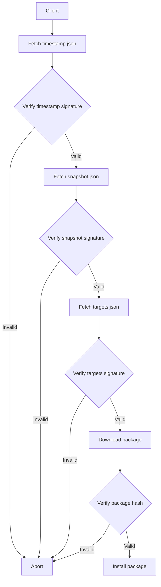
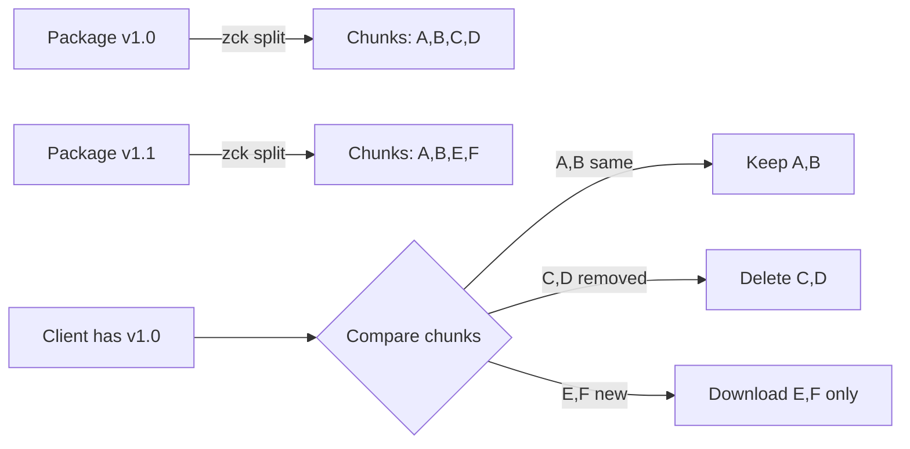
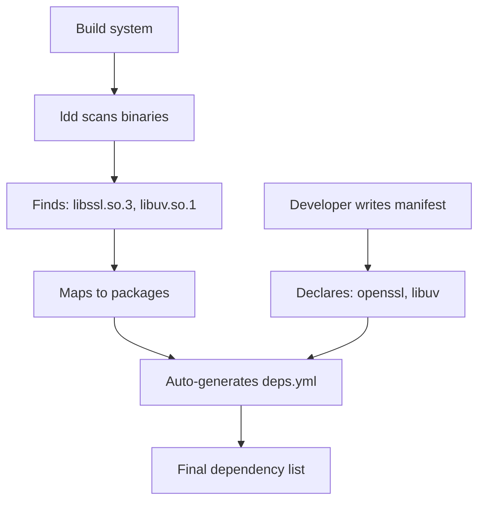
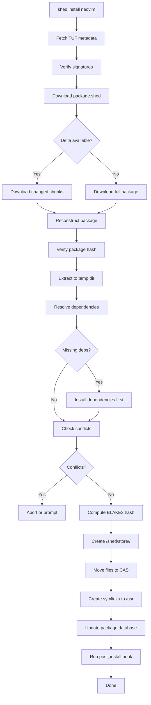
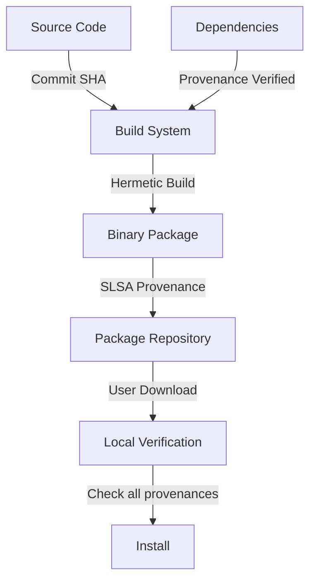

# .shed Package Format Specification v1.0

> [!IMPORTANT]
> **Purpose**: This specification documents the `.shed` package format for **future ShedOS rebuild from scratch**. This format is **NOT implemented in the current shedman package manager** and will **NOT be used** in the Arch-based ShedOS implementation. This is reference documentation for future ShedOS development.

---

## Table of Contents

1. [Overview](#overview)
2. [File Structure](#file-structure)
3. [Manifest Format](#manifest-format)
4. [Content-Addressable Storage (CAS)](#content-addressable-storage-cas)
5. [Security: TUF Framework](#security-tuf-framework)
6. [Provenance: SLSA](#provenance-slsa)
7. [Delta Updates: zchunk](#delta-updates-zchunk)
8. [Sandboxing: Bubblewrap](#sandboxing-bubblewrap)

9. [Dependency Resolution](#dependency-resolution)
10. [Binary vs Source Packages](#binary-vs-source-packages)
11. [Build Process](#build-process)
12. [Installation Flow](#installation-flow)
13. [Rollback & Atomic Updates](#rollback--atomic-updates)
14. [Repository Structure](#repository-structure)

---

## Overview

### Design Goals

The `.shed` package format is designed as a **next-generation package format** for ShedOS, incorporating modern security, efficiency, and reliability practices.

**Core Principles:**

1. **Security-First**: All packages signed, provenance tracked, rollback-protected, hermetic builds
2. **Efficient**: Delta updates, deduplication, concurrent installation
3. **Atomic**: All-or-nothing updates, instant rollbacks
4. **Sandboxed**: Permission-based isolation by default
5. **Declarative**: Source packages rebuild identically (SLSA Level 4)
6. **x86_64 Only**: Optimized for x86_64 architecture
7. **Verifiable**: Build provenance verification for entire dependency tree
8. **Distributed Trust**: Multi-party signature threshold for critical operations

### Design Philosophy

> "NPM-like simplicity with Nix-like power"

Developers write minimal YAML manifests. The build system handles:

- Dependency detection
- Signature generation
- Chunk splitting
- Provenance attestation
- Optimized x86_64 builds

---

## File Structure

A `.shed` package is a **zstd-compressed tar archive** with **zchunk chunking** for delta updates.

### Package Archive Layout

```
neovim-0.10.0-x86_64.shed  (tar.zst with zchunk)
├── manifest.yml            # Package metadata
├── files/                  # Binary payload (for binary packages)
│   ├── usr/
│   │   ├── bin/
│   │   │   └── nvim
│   │   ├── lib/
│   │   └── share/
│   └── etc/
├── build.sh                # Build script (source packages only)
├── sources/                # Source code (source packages only)
│   └── neovim-0.10.0.tar.gz
├── deps.yml                # Auto-generated dependency mapping
├── signatures/             # Cryptographic signatures
│   ├── package.sig         # Ed25519 package signature
│   └── tuf/                # TUF metadata
│       ├── targets.json
│       └── timestamp.json
├── sbom.json               # Software Bill of Materials
└── provenance.json         # SLSA provenance attestation
```

### Archive Format Details

```bash
# Format: tar + zstd + zchunk
tar -cf - . | zstd | zck > neovim-0.10.0.shed

# Compression: zstd level 19 (maximum)
# Chunking: zchunk with 1MB chunk size
# Hash: BLAKE3 for content-addressable storage
```

---

## Manifest Format

### manifest.yml

The manifest is the **only required file** developers write.

```yaml
# ============================================
# Basic Metadata (Required)
# ============================================
name: "neovim"
version: "0.10.0"
release: 1                         # Package release number
description: "Vim-fork focused on extensibility and usability"
url: "https://neovim.io"
license: "Apache-2.0"
arch: "x86_64"                     # Target architecture
type: "binary"                     # "binary" or "source"

# ============================================
# Maintainer Information
# ============================================
maintainer:
  name: "ShedOS Team"
  email: "packages@shedos.org"
  pgp_key: "0x1234567890ABCDEF"

# ============================================
# Dependencies (Abstract Names)
# ============================================
depends:
  - openssl >= 3.0
  - libuv >= 1.44
  - msgpack-c >= 4.0
  - luajit
  - tree-sitter
  - unibilium
  - libtermkey
  - libvterm

optdepends:
  - "python: Python plugin support"
  - "ruby: Ruby plugin support"
  - "node: Node.js plugin support"
  - "xclip: Clipboard integration"
  - "wl-clipboard: Wayland clipboard support"

makedepends:                       # Build-time only (source packages)
  - cmake >= 3.13
  - ninja
  - gcc >= 11
  - gettext

# ============================================
# Sandboxing Permissions
# ============================================
permissions:
  network: false                   # ❌ No network by default
  audio: false                     # ❌ No audio access
  gpu: false                       # ❌ No GPU access (3D)
  camera: false                    # ❌ No camera
  microphone: false                # ❌ No microphone
  bluetooth: false                 # ❌ No Bluetooth
  usb: false                       # ❌ No USB devices
  
  # File system access (whitelist)
  filesystem:
    read_write:
      - "$HOME"                    # Full home directory access
      - "/tmp"                     # Temp directory
    read_only:
      - "/usr/share"               # System resources
      - "/etc"                     # System config (read-only)
  
  # System capabilities
  capabilities: []                 # No special caps by default
  
  # X11/Wayland
  display: true                    # ✅ GUI access (terminal needs this)
  
  # D-Bus access
  dbus:
    session: ["org.freedesktop.Notifications"]
    system: []

# ============================================
# Package Metadata
# ============================================
provides:                          # Virtual packages this provides
  - vim-compatible
  
replaces:                          # Packages this replaces
  - vim-minimal
  
conflicts:                         # Packages incompatible with this
  - vim-full

# ============================================
# Installation Hooks
# ============================================
hooks:
  pre_install: |
    # Bash script executed before installation
    echo "Preparing neovim installation..."
  
  post_install: |
    # Bash script executed after installation
    update-desktop-database -q
    
  pre_remove: |
    # Cleanup before removal
    
  post_remove: |
    # Cleanup after removal
    update-desktop-database -q

# ============================================
# File Attributes (Optional)
# ============================================
file_attrs:
  "/usr/bin/nvim":
    mode: "0755"
    owner: "root"
    group: "root"

# ============================================
# Build Configuration (Source Packages)
# ============================================
build:
  source_url: "https://github.com/neovim/neovim/archive/refs/tags/v0.10.0.tar.gz"
  source_hash: "sha256:a1b2c3d4..."
  build_script: "build.sh"
  parallel: true                   # Allow parallel make
  jobs: 4                          # Max parallel jobs
```

---

## Content-Addressable Storage (CAS)

### Storage Layout

All packages are stored by **content hash** in a deduplicated store:

```
/shed/store/
├── blake3-a1b2c3d4e5f6.../      # Package A v1.0
│   ├── usr/
│   │   └── bin/
│   │       └── app-a
│   └── manifest.yml
│
├── blake3-1a2b3c4d5e6f.../      # Package A v1.1 (similar files)
│   ├── usr/
│   │   └── bin/
│   │       └── app-a            # Only changed files stored
│   └── manifest.yml
│
└── shared/                       # Deduplicated files
    └── blake3-xyz123.../
        └── libcommon.so          # Shared by multiple packages
```

### Active Installation (Symlinks)

```
/usr/bin/app-a -> /shed/store/blake3-1a2b3c4d.../usr/bin/app-a
/usr/lib/libcommon.so -> /shed/store/shared/blake3-xyz123.../libcommon.so
```

### Benefits

1. **Deduplication**: Identical files stored once
2. **Atomic Updates**: Symlink switching is atomic
3. **Instant Rollback**: Previous versions preserved
4. **Disk Efficiency**: Save space on similar packages
5. **Reproducibility**: Hash-based addressing ensures integrity

### Garbage Collection

```bash
# Remove unreferenced store entries
shed gc

# Remove everything except active + last 2 versions
shed gc --keep-versions 2
```

---

## Security: TUF Framework

The Update Framework (TUF) protects against:

- **Freeze attacks**: Serving old vulnerable packages
- **Mix-and-match attacks**: Mismatched package dependencies
- **Rollback attacks**: Downgrading to vulnerable versions
- **Indefinite freeze attacks**: metadata expiration
- **Arbitrary package attacks**: Signature verification
- **Slow retrieval attacks**: Metadata size limits

### TUF Key Hierarchy

```
Root Key (Offline, Cold Storage)
    ├── Targets Key (Signs package manifests)
    ├── Snapshot Key (Signs repository state)
    └── Timestamp Key (Short-lived, automated)
```

### Metadata Files

#### root.json (Root of Trust)

```json
{
  "spec_version": "1.0.0",
  "version": 5,
  "expires": "2027-01-01T00:00:00Z",
  "keys": {
    "ed25519-rootkey-id": {
      "keytype": "ed25519",
      "scheme": "ed25519",
      "keyval": {
        "public": "abcd1234..."
      }
    }
  },
  "roles": {
    "root": {
      "threshold": 2,
      "keyids": ["ed25519-rootkey-id"]
    },
    "targets": {
      "threshold": 1,
      "keyids": ["ed25519-targetskey-id"]
    },
    "snapshot": {
      "threshold": 1,
      "keyids": ["ed25519-snapshotkey-id"]
    },
    "timestamp": {
      "threshold": 1,
      "keyids": ["ed25519-timestampkey-id"]
    }
  }
}
```

#### targets.json (Package Manifests)

```json
{
  "spec_version": "1.0.0",
  "version": 1234,
  "expires": "2026-02-01T00:00:00Z",
  "targets": {
    "neovim-0.10.0-x86_64.shed": {
      "length": 45821952,
      "hashes": {
        "blake3": "a1b2c3d4...",
        "sha256": "e5f6g7h8..."
      },
      "custom": {
        "manifest_hash": "blake3:xyz123...",
        "slsa_level": 3
      }
    }
  }
}
```

#### snapshot.json (Repository State)

```json
{
  "spec_version": "1.0.0",
  "version": 5678,
  "expires": "2026-01-15T00:00:00Z",
  "meta": {
    "targets.json": {
      "version": 1234,
      "hashes": {
        "blake3": "abc123..."
      }
    }
  }
}
```

#### timestamp.json (Freshness)

```json
{
  "spec_version": "1.0.0",
  "version": 91011,
  "expires": "2026-01-12T12:00:00Z",
  "meta": {
    "snapshot.json": {
      "version": 5678,
      "hashes": {
        "blake3": "def456..."
      }
    }
  }
}
```

### Update Verification Flow



---

## Provenance: SLSA

SLSA (Supply-chain Levels for Software Artifacts) provides **build provenance**.

### SLSA Levels

| Level | Requirements |
|-------|--------------|
| **SLSA 1** | Build script exists, basic provenance |
| **SLSA 2** | Version control, signed provenance |
| **SLSA 3** | Hardened builds, non-falsifiable provenance |
| **SLSA 4** | Two-party review, hermetic builds |

### provenance.json

```json
{
  "_type": "https://in-toto.io/Statement/v0.1",
  "subject": [
    {
      "name": "pkg:shedos/neovim@0.10.0",
      "digest": {
        "blake3": "a1b2c3...",
        "sha256": "e5f6g7..."
      }
    }
  ],
  "predicateType": "https://slsa.dev/provenance/v0.2",
  "predicate": {
    "builder": {
      "id": "https://github.com/shedos/shedrepo/actions/workflows/build.yml@refs/heads/main"
    },
    "buildType": "https://shedos.org/shed-builder/v1",
    "invocation": {
      "configSource": {
        "uri": "git+https://github.com/shedos/shedrepo",
        "digest": {
          "sha1": "abcdef123..."
        },
        "entryPoint": "packages/neovim/PKGBUILD"
      }
    },
    "metadata": {
      "buildStartedOn": "2024-12-30T10:00:00Z",
      "buildFinishedOn": "2024-12-30T10:15:00Z",
      "completeness": {
        "parameters": true,
        "environment": true,
        "materials": true
      },
      "reproducible": true
    },
    "materials": [
      {
        "uri": "https://github.com/neovim/neovim/archive/v0.10.0.tar.gz",
        "digest": {
          "sha256": "xyz789..."
        }
      }
    ]
  }
}
```

### SBOM (Software Bill of Materials)

```json
{
  "bomFormat": "CycloneDX",
  "specVersion": "1.4",
  "version": 1,
  "metadata": {
    "component": {
      "type": "application",
      "name": "neovim",
      "version": "0.10.0"
    }
  },
  "components": [
    {
      "type": "library",
      "name": "openssl",
      "version": "3.0.12",
      "purl": "pkg:shedos/openssl@3.0.12"
    },
    {
      "type": "library",
      "name": "libuv",
      "version": "1.44.2",
      "purl": "pkg:shedos/libuv@1.44.2"
    }
  ]
}
```

---

## Delta Updates: zchunk

**zchunk** enables downloading only changed chunks between package versions.

### How It Works



### Chunk Creation

```bash
# Build process automatically creates chunks
tar -cf - files/ | zstd | zck --chunk-size 1M > package.shed

# Metadata embedded in .shed file
zck_header:
  chunk_size: 1048576  # 1MB
  checksum_type: "blake3"
  chunks:
    - hash: "blake3:abc123"
      offset: 0
      length: 1048576
    - hash: "blake3:def456"
      offset: 1048576
      length: 523421
```

### Update Example

```bash
# User has neovim 0.10.0 installed (200MB)
# Update to 0.10.1 available (200MB)
# Only 5MB changed

shed update neovim
# → Downloads .shed header (1KB)
# → Compares local chunks with remote
# → Downloads only 5MB of changed chunks
# → Reconstructs 0.10.1 locally
# → 97.5% bandwidth saved
```

### HTTP Range Requests

```http
GET /packages/neovim-0.10.1.shed HTTP/1.1
Host: repo.shedos.org
Range: bytes=1048576-1572352,5242880-7340032

# Downloads only changed chunk ranges
```

---

## Sandboxing: Bubblewrap

All packages run in **bubblewrap** containers with declared permissions.

### Permission Model

```yaml
# manifest.yml
permissions:
  network: false        # No network access
  filesystem:
    read_write:
      - "$HOME/Documents"
    read_only:
      - "/usr/share/myapp"
```

### Runtime Container

```bash
# shedman spawns bubblewrap when launching app
bwrap \
  --ro-bind /usr /usr \
  --ro-bind /etc /etc \
  --bind /home/user/Documents /home/user/Documents \
  --tmpfs /tmp \
  --unshare-net \           # No network (permission: network: false)
  --dev-bind /dev/dri /dev/dri \  # GPU access (if permitted)
  --setenv HOME /home/user \
  /usr/bin/myapp
```

### Permission Enforcement

```go
// shedman checks permissions before launch
func LaunchApp(pkg Package, args []string) error {
    perms := pkg.Manifest.Permissions
    
    bwrapArgs := []string{}
    
    // Network
    if !perms.Network {
        bwrapArgs = append(bwrapArgs, "--unshare-net")
    }
    
    // Filesystem
    for _, path := range perms.Filesystem.ReadWrite {
        expanded := os.ExpandEnv(path)
        bwrapArgs = append(bwrapArgs, "--bind", expanded, expanded)
    }
    
    // Audio
    if !perms.Audio {
        // Don't mount /dev/snd
    } else {
        bwrapArgs = append(bwrapArgs, "--dev-bind", "/dev/snd", "/dev/snd")
    }
    
    // Execute in sandbox
    return exec.Command("bwrap", append(bwrapArgs, pkg.Binary)...).Run()
}
```

---

---

## Dependency Resolution

### Hybrid Approach

Combines **declarative** (manifest) and **auto-detection** (ldd analysis).



### deps.yml (Auto-Generated)

```yaml
# Auto-detected runtime dependencies
runtime:
  required:
    - name: openssl
      version: ">= 3.0"
      provides: ["lib:libssl.so.3", "lib:libcrypto.so.3"]
      
    - name: libuv
      version: ">= 1.44"
      provides: ["lib:libuv.so.1"]
      
    - name: libc
      version: ">= 2.35"
      provides: ["lib:libc.so.6"]

  optional:
    - name: python
      version: ">= 3.10"
      reason: "Python plugin support"

# Build-time dependencies (not needed at runtime)
build:
  - cmake
  - ninja
  - gcc
```

### Dependency Resolution Algorithm

```python
def resolve_deps(package):
    """
    Topological sort with version constraint satisfaction
    """
    deps = []
    visited = set()
    
    def visit(pkg):
        if pkg in visited:
            return
        visited.add(pkg)
        
        for dep in pkg.depends:
            # Find satisfying package version
            candidate = find_package(dep.name, dep.version_constraint)
            if not candidate:
                raise DependencyError(f"No package satisfies {dep}")
            
            visit(candidate)
            deps.append(candidate)
        
        deps.append(pkg)
    
    visit(package)
    return deps  # Installation order
```

---

## Binary vs Source Packages

### Binary Packages

```yaml
type: "binary"
```

**Contains:**

- Pre-compiled binaries
- Shared libraries
- Configuration files
- Documentation

**Advantages:**

- Fast installation
- No build dependencies
- Consistent across systems

### Source Packages

```yaml
type: "source"
build:
  source_url: "https://..."
  source_hash: "sha256:..."
  build_script: "build.sh"
```

**Contains:**

- Source code tarball
- Build script
- Patches (if any)

**Advantages:**

- Optimization for local CPU
- Transparency (inspect source)
- Support architectures without binary builds

### build.sh (POSIX Shell)

```bash
#!/bin/sh
# build.sh for neovim

set -e

# Variables provided by shed build system:
# $srcdir  - source extraction directory
# $pkgdir  - installation staging directory
# $prefix  - installation prefix (/usr)

cd "$srcdir"

cmake -B build \
  -DCMAKE_BUILD_TYPE=Release \
  -DCMAKE_INSTALL_PREFIX="$prefix"

cmake --build build --parallel

DESTDIR="$pkgdir" cmake --install build
```

---

## Build Process

### CI/CD Build Pipeline


### Local Build

```bash
# Build from manifest
shed build manifest.yml

# Steps:
# 1. Parse manifest.yml
# 2. Download sources (if source package)
# 3. Execute build.sh in sandbox
# 4. Scan binaries for dependencies (ldd)
# 5. Generate deps.yml
# 6. Create tar archive
# 7. Compress with zstd
# 8. Split into zchunks
# 9. Sign with local key
# 10. Output: neovim-0.10.0-x86_64.shed
```

---

## Installation Flow



---

## Rollback & Atomic Updates

### Atomic Update Mechanism

```bash
# Before update:
/usr/bin/nvim -> /shed/store/blake3-old123.../usr/bin/nvim

# During update:
# 1. Extract new version to /shed/store/blake3-new456.../
# 2. All files extracted
# 3. Atomically switch symlink:
mv /usr/bin/nvim /usr/bin/nvim.old
ln -s /shed/store/blake3-new456.../usr/bin/nvim /usr/bin/nvim

# If anything fails, symlink never changes = atomic
```

### Rollback

```bash
# List previous versions
shed history neovim
# → 0.10.1 (current) - blake3-abc123
# → 0.10.0 - blake3-def456
# → 0.9.5 - blake3-ghi789

# Rollback to 0.10.0
shed rollback neovim@0.10.0

# Just repoints symlinks:
/usr/bin/nvim -> /shed/store/blake3-def456.../usr/bin/nvim

# Instant (no download needed)
```

---

## Repository Structure

```
repo.shedos.org/
├── shed/                           # .shed packages
│   ├── tuf/                        # TUF metadata
│   │   ├── root.json
│   │   ├── targets.json
│   │   ├── snapshot.json
│   │   └── timestamp.json
│   │
│   └── packages/
│       └── neovim/
│           ├── 0.10.0/
│           │   ├── neovim-0.10.0-x86_64.shed
│           │   ├── manifest.yml
│           │   └── provenance.json
│           └── 0.10.1/
│               └── ...
```

---

## Summary

The `.shed` format provides:

✅ **Security**: TUF framework, Ed25519 signatures, SLSA provenance  
✅ **Efficiency**: zchunk delta updates, CAS deduplication  
✅ **Reliability**: Atomic updates, instant rollbacks  
✅ **Sandboxing**: Bubblewrap permission isolation  
✅ **x86_64 Optimized**: Focused on x86_64 architecture  
✅ **Flexibility**: Binary and source packages  
✅ **Transparency**: SBOM, provenance, reproducible builds  

---

## Hermetic Builds (SLSA Level 4)

The `.shed` format requires **hermetic (reproducible) builds** as a core feature.

### What Are Hermetic Builds?

Hermetic builds are fully reproducible builds in completely isolated containers:

- Build happens with **ZERO network access**
- All inputs (source code, compilers, libraries) explicitly declared with checksums
- Same inputs = **bit-for-bit identical output** every time

### Why Hermetic Builds Matter

- **Reproducibility**: Anyone can independently verify the build wasn't tampered with
- **Security**: Prevents supply chain attacks during the build process
- **Trust**: Can cryptographically verify package actually came from declared source
- **Compliance**: Meets SLSA Level 4 requirements for secure software supply chain

### Implementation

```yaml
# manifest.yml - Hermetic build specification
build:
  hermetic: true
  
  # All inputs must be declared with checksums
  inputs:
    source:
      url: "https://github.com/neovim/neovim/archive/v0.10.0.tar.gz"
      sha256: "abc123..."
    
    build_tools:
      - name: "gcc"
        version: "13.2.0"
        sha256: "def456..."
      - name: "cmake"
        version: "3.27.0"
        sha256: "ghi789..."
    
    dependencies:
      - name: "openssl"
        version: "3.0.12"
        sha256: "jkl012..."
  
  # Build environment must be isolated
  isolation:
    network: false        # No network access during build
    filesystem: "readonly" # Read-only base system
    
  # Reproducible flags
  reproducible:
    source_date_epoch: 1234567890
    build_path: "/build"
```

### Build Attestation

Every hermetic build generates an attestation proving it was built correctly:

```json
{
  "hermetic": true,
  "reproducible": true,
  "inputs_hash": "blake3:all_inputs_combined",
  "output_hash": "blake3:final_package",
  "build_log_hash": "blake3:complete_build_log",
  "slsa_level": 4
}
```

---

## Distributed Key Management

The `.shed` format supports **multi-party signature threshold** for enhanced security.

### Multi-Signature Threshold

Instead of a single signing key, critical operations require M-of-N signatures:

```yaml
# Example: 3 out of 5 maintainers must sign
threshold:
  required: 3
  total: 5
  
keys:
  - id: "maintainer-alice"
    public_key: "ed25519:abc123..."
  - id: "maintainer-bob"
    public_key: "ed25519:def456..."
  - id: "maintainer-charlie"
    public_key: "ed25519:ghi789..."
  - id: "maintainer-diana"
    public_key: "ed25519:jkl012..."
  - id: "maintainer-eve"
    public_key: "ed25519:mno345..."
```

### Benefits

- **Security**: Single compromised key cannot create malicious packages
- **Resilience**: Lost key doesn't break the system (if M others available)
- **Trust**: Requires collusion of multiple parties to attack
- **Governance**: Enforces review processes

### TUF Integration

The Update Framework (TUF) natively supports threshold signatures:

```json
// root.json
{
  "roles": {
    "targets": {
      "threshold": 3,
      "keyids": [
        "alice-key-id",
        "bob-key-id",
        "charlie-key-id",
        "diana-key-id",
        "eve-key-id"
      ]
    }
  }
}
```

### Use Cases

- **Large organizations**: Multiple teams must approve releases
- **Critical packages**: Kernel, bootloader, init system
- **Compliance**: Meet regulatory requirements for multi-party approval

---

## Build Provenance Verification

The `.shed` format includes **automated verification** of build provenance for the entire dependency tree.

### Chain of Custody

Every package includes provenance that can be verified:

```bash
# Verify single package
shed verify neovim-0.10.0.shed
✓ Package signature valid
✓ SLSA provenance present (Level 4)
✓ Hermetic build verified
✓ All inputs match declared checksums

# Verify entire dependency tree
shed verify --recursive neovim-0.10.0.shed
✓ neovim-0.10.0: SLSA 4, hermetic
✓ openssl-3.0.12: SLSA 4, hermetic
✓ libuv-1.44.2: SLSA 4, hermetic
✓ luajit-2.1.0: SLSA 4, hermetic
→ All 47 dependencies verified
```

### Provenance Chain



### Integration with CI/CD

Build provenance is automatically generated by the build system:

```yaml
# GitHub Actions example
name: Build Package

on: push

jobs:
  build:
    runs-on: ubuntu-latest
    
    steps:
      - name: Build with provenance
        run: |
          shed build manifest.yml \
            --hermetic \
            --generate-provenance \
            --sign-with ${{ secrets.SIGNING_KEY }}
      
      - name: Verify build
        run: |
          shed verify output/*.shed
      
      - name: Upload to repository
        run: |
          shed upload output/*.shed --repo shedos
```

### Dependency Tree Verification

Before installation, verify the entire dependency tree:

```go
// Pseudocode for verification
func VerifyPackage(pkg *Package) error {
    // 1. Verify package signature
    if err := pkg.VerifySignature(); err != nil {
        return err
    }
    
    // 2. Verify SLSA provenance exists
    provenance := pkg.GetProvenance()
    if provenance.SLSALevel < 4 {
        return errors.New("requires SLSA level 4")
    }
    
    // 3. Verify hermetic build
    if !provenance.Hermetic {
        return errors.New("non-hermetic build")
    }
    
    // 4. Recursively verify all dependencies
    for _, dep := range pkg.Dependencies {
        if err := VerifyPackage(dep); err != nil {
            return fmt.Errorf("dependency %s failed: %w", dep.Name, err)
        }
    }
    
    return nil
}
```

### Security Benefits

- **Transparency**: Know exactly how every package was built
- **Attack Detection**: Compromised build systems are detectable
- **Compliance**: Meet security audit requirements
- **Trust**: Verify entire supply chain integrity

---

> **Remember**: This specification is for **future ShedOS from scratch**. The current shedman package manager uses **native Arch packages (.pkg.tar.zst)** and **pacman/go-alpm** for package management.
