# ShedOS Ecosystem Architecture - Complete Plan

## Repository Structure

| Repo | Purpose | Language |
|------|---------|----------|
| `shedman` | Package manager CLI | Go |
| `shedrepo` | Build scripts, CI/CD, R2 upload | Shell/Python |
| `shedos` | ISO, branding, installer | Shell/Python |
| `shedos-calamares` | Custom installer fork | C++/Qt/Python |

### CI/CD Pipeline

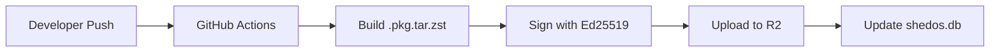

## Domain Structure

| Subdomain | Purpose |
|-----------|---------|
| `shedos.org` | Main website |
| `repo.shedos.org` | Package repository (R2) |
| `docs.shedos.org` | Documentation |
| `packages.shedos.org` | Package search/browser |
| `status.shedos.org` | Service status page |

## shedrepo Architecture (repo.shedos.org)

Hosted on **Cloudflare R2**, serves Arch packages for ShedOS.

### Directory Structure

```
repo.shedos.org/
└── arch/                           # ShedOS packages (Arch format)
    └── x86_64/
        ├── shedos.db               # Pacman database
        ├── shedos.db.sig
        └── packages/
            └── neovim-0.10.0.pkg.tar.zst
```

### URL Endpoints

| Purpose | URL |
|---------|-----|
| Arch DB | `repo.shedos.org/arch/x86_64/shedos.db` |
| Arch Pkg | `repo.shedos.org/arch/x86_64/packages/*.pkg.tar.zst` |

### shedman Package Resolution

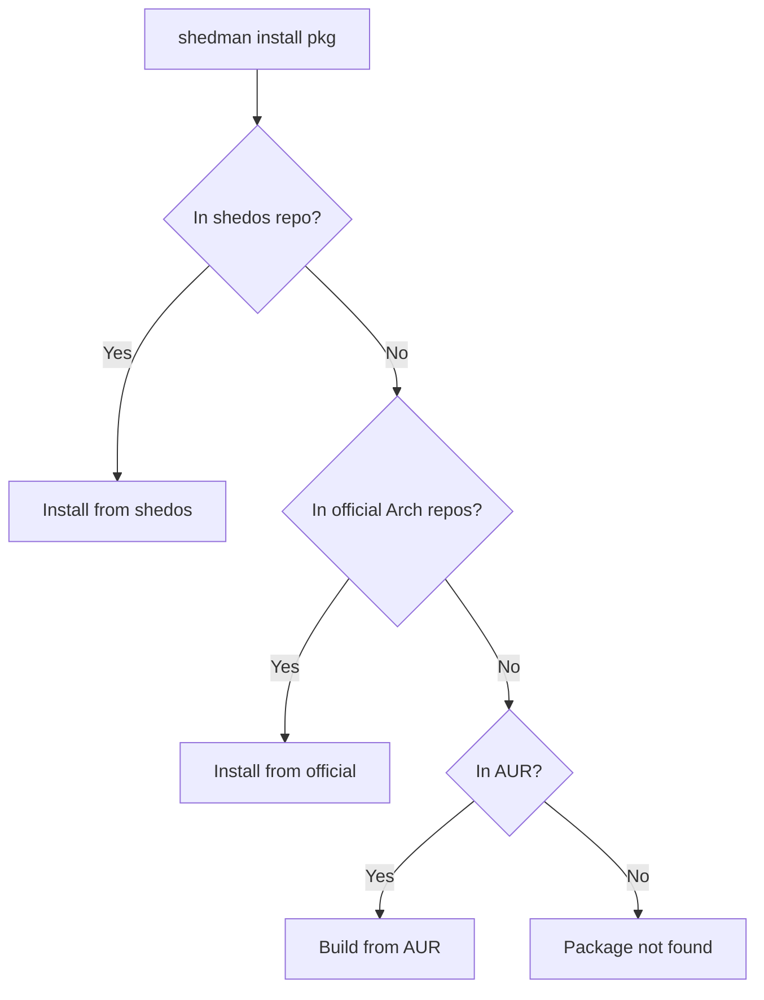

**Priority**: shedos repo → official Arch repos → AUR

---

# Vision

> **"You should never have to think twice before reformatting your computer."**

shedman is the **primary package manager for ShedOS** — an Arch-based Linux distribution designed to solve the pain points of traditional package management.

## Core Principles

1. **Arch-Native** — designed specifically for Arch-based distributions (ShedOS, Arch Linux, Manjaro, EndeavourOS)
2. **100% Pacman Compatible** — supports all pacman flags and directly uses /etc/pacman.conf
3. **Modular Design** — separate concerns (core, snapshot, config, de, theme) composed into unified CLI
4. **Never Lose Your Data** — cloud + USB snapshots, restore after reinstall
5. **Native Implementation** — uses `go-alpm` library directly, shells to pacman for installations

## What Makes shedman Different

| Feature | pacman/yay | shedman |
|---------|------------|---------|
| Modular architecture | ❌ Monolithic | ✅ Separate modules |
| System snapshots | ❌ External tools | ✅ Integrated |
| DE switching | ❌ Manual | ✅ `shedman de switch` |
| Theme management | ❌ Manual | ✅ `shedman theme apply` |
| Config packages | ❌ | ✅ `shedman config install` |
| Service management | ❌ Must use systemctl | ✅ `shedman svc enable` |
| Implementation | C/Bash | Go with go-alpm |

---

# Arch Linux Compatibility

On Arch-based systems (including ShedOS), shedman provides full compatibility with the pacman ecosystem via native `libalpm` integration.

## Pacman Command Compatibility

shedman supports familiar pacman-style commands:

```bash
# These work like pacman
shedman -Syu                    # Update system
shedman -S neovim               # Install package
shedman -R firefox              # Remove package
shedman -Ss vim                 # Search packages
shedman -Qi neovim              # Query package info
shedman -Ql neovim              # List package files
```

All pacman flags are supported for users transitioning from pacman.

## Existing Package Benefits

All packages installed with pacman/yay before switching to shedman:

- Automatically tracked by shedman
- Benefit from snapshots, verification
- Show in `shedman history` from point of migration

## Pacman Config Integration

shedman automatically reads and uses `/etc/pacman.conf`:

- No migration needed
- All pacman settings respected
- Mirror configuration preserved
- IgnorePkg/IgnoreGroup honored
- ParallelDownloads setting used
- SigLevel settings enforced

## Symlink Compatibility

```bash
sudo ln -sf /usr/bin/shedman /usr/bin/pacman
# Now all scripts using pacman automatically use shedman
```

---

# Never Lose Your Data

## Philosophy

> Linux should be as forgiving as macOS Time Machine. Reformatting should be painless.

Users can restore their complete system state from:

- **Cloud** (Google Drive, R2, S3, GCS, Azure)
- **USB flash drive** (local disk)
- **External hard drive**

## Restore Flow After Reinstall

1. Install fresh ShedOS (or any Arch flavor)
2. Install shedman: `pacman -S shedman`
3. Restore from USB: `shedman snapshot restore --disk /dev/sdb1`
4. Or cloud: `shedman snapshot pull 5 --remote gdrive && shedman snapshot restore 5`
5. System restored: packages, configs, themes, home directory

---

# Part 1: shedman CLI Reference

## Global Flags

| Flag | Short | Description |
|------|-------|-------------|
| `--yes` | `-y` | Skip all confirmations |
| `--noconfirm` | | Alias for `-y` (pacman compat) |
| `--quiet` | `-q` | Minimal output |
| `--verbose` | `-v` | Detailed output |
| `--debug` | | Developer debug output |
| `--dry-run` | | Preview without executing |
| `--color` | | Force colored output |
| `--no-color` | | Disable colors |
| `--config` | `-c` | Custom config file path |

---

## 1. Package Management Commands

### `shedman sync`

Synchronize package databases.

```bash
shedman sync                    # Sync all databases
shedman sync --shedos           # Sync shedos repo only
shedman sync --official         # Sync official repos only
shedman sync --aur              # Refresh AUR cache
```

### `shedman install`

Install packages.

```bash
shedman install <pkg>           # Install from best source
shedman install <pkg> --aur     # Force install from AUR
shedman install <pkg> --official  # Force from official
shedman install <pkg> --shedos  # Force from shedos repo
shedman install @<group>        # Install package group
```

| Flag | Description |
|------|-------------|
| `-y`, `--yes` | Skip confirmation |
| `--needed` | Skip if already installed |
| `--asdeps` | Install as dependency |
| `--asexplicit` | Install as explicit |
| `--downloadonly` | Download without installing |
| `--overwrite <glob>` | Overwrite conflicting files |

### Package Groups

Install curated package collections with `@group` syntax:

```bash
shedman install @dev               # Development tools
shedman install @gaming            # Gaming essentials
shedman install @multimedia        # Audio/video production
```

#### Available Groups

| Group | Description | Key Packages |
|-------|-------------|--------------|
| `@base` | Minimal system | base, linux, linux-firmware |
| `@dev` | Dev environment | git, neovim, gcc, make, cmake, gdb |
| `@web-dev` | Web development | nodejs, npm, yarn, docker, nginx |
| `@python-dev` | Python stack | python, pip, poetry, pyenv, ipython |
| `@rust-dev` | Rust stack | rust, cargo, rust-analyzer |
| `@go-dev` | Go stack | go, gopls, delve |
| `@jvm-dev` | JVM stack | jdk-openjdk, kotlin, gradle, maven, intellij-idea-ce |
| `@gaming` | Gaming | steam, wine, gamemode, mangohud, lutris |
| `@multimedia` | Media production | obs-studio, kdenlive, audacity, gimp, inkscape |
| `@office` | Productivity | libreoffice, thunderbird, zathura |
| `@virtualization` | VMs & containers | qemu, libvirt, virt-manager, docker, podman |
| `@fonts` | Font collection | noto-fonts, ttf-jetbrains-mono, ttf-firacode |
| `@shedos-hyprland` | ShedOS Hyprland DE | hyprland, waybar, wofi, kitty, shedos-configs-hypr |
| `@shedos-gnome` | ShedOS GNOME DE | gnome-shell, gdm, nautilus, shedos-configs-gnome |
| `@shedos-kde` | ShedOS KDE DE | plasma-desktop, sddm, dolphin, shedos-configs-kde |
| `@shedos-cosmic` | ShedOS COSMIC DE | cosmic-desktop, shedos-configs-cosmic |

#### Group Management

```bash
shedman group list                 # List all available groups
shedman group info @dev            # Show packages in group
shedman group install @gaming      # Install group (alias for shedman install @gaming)
shedman group remove @gaming       # Remove all packages from group
```

### `shedman update`

Update installed packages.

```bash
shedman update                  # Update all packages
shedman update <pkg>            # Update specific package
shedman update --shedos         # Update shedos packages only
shedman update --official       # Update official packages only
shedman update --aur            # Update AUR packages only
```

| Flag | Description |
|------|-------------|
| `-y`, `--yes` | Skip confirmation |
| `--ignore <pkg>` | Skip package during update |
| `--ignoregroup <grp>` | Skip package group |

### `shedman remove`

Remove packages.

```bash
shedman remove <pkg>            # Remove package
shedman remove <pkg> --purge    # Remove + delete configs
shedman remove <pkg> -s         # Remove + orphan deps
```

| Flag | Description |
|------|-------------|
| `-s`, `--recursive` | Remove unused dependencies |
| `--purge` | Also remove config files |
| `-y`, `--yes` | Skip confirmation |

### `shedman search`

Search for packages.

```bash
shedman search <query>          # Search all sources
shedman search <query> --aur    # Search AUR only
shedman search <query> --official  # Search official only
shedman search <query> --shedos # Search shedos only
shedman search <query> --installed  # Search installed only
```

Output shows source badges:

```
 📦 neovim             0.10.0-1    [official]
 📦 neovim-nightly     0.11.0-1    [aur]
 📦 shedos-configs-nvim 1.0.0     [shedos]
```

### `shedman info`

Show package information.

```bash
shedman info <pkg>              # Show package details
shedman info <pkg> --json       # Output as JSON
```

### `shedman history`

View transaction history.

```bash
shedman history                 # Show recent transactions
shedman history --json          # Output as JSON
shedman history --since <date>  # Filter by date
shedman history --package <pkg> # Filter by package
```

---

## 2. System Utilities

### `shedman doctor`

Check system health.

```bash
shedman doctor                  # Run all checks
shedman doctor --fix            # Attempt auto-fix
```

Checks: orphans, missing deps, file conflicts, database integrity, disk space.

### `shedman clean`

Clean caches and unused data.

```bash
shedman clean                   # Clean package cache (keep 3)
shedman clean --all             # Clean everything
shedman clean --cache           # Clean download cache only
shedman clean --orphans         # Remove orphan packages
shedman clean --snapshots       # Remove old snapshots
shedman clean --keep <n>        # Keep last n versions
```

### `shedman orphans`

Manage orphan packages.

```bash
shedman orphans                 # List orphan packages
shedman orphans --remove        # Remove all orphans
```

### `shedman owns`

Find which package owns a file.

```bash
shedman owns /usr/bin/nvim      # Find owner of file
```

### `shedman why`

Show why a package is installed.

```bash
shedman why <pkg>               # Show reverse dependencies
shedman why <pkg> --tree        # Show dependency tree
```

### `shedman diff`

Preview pending updates.

```bash
shedman diff                    # Show all pending updates
shedman diff <pkg>              # Show diff for package
shedman diff --changelog        # Include changelogs
```

### `shedman verify`

Verify package integrity.

```bash
shedman verify                  # Verify all packages
shedman verify <pkg>            # Verify specific package
shedman verify --fix            # Reinstall corrupted packages
```

### `shedman repair`

Repair package database.

```bash
shedman repair                  # Rebuild database
```

### `shedman size`

Show disk usage.

```bash
shedman size <pkg>              # Show package size + deps
```

### `shedman download`

Download without installing.

```bash
shedman download <pkg>          # Download package + deps
```

---

## 3. Desktop Environment Commands

### `shedman de list`

List available desktop environments.

```bash
shedman de list
#  hyprland    [installed] (current)
#  gnome       
#  kde         
#  cosmic      
```

### `shedman de switch`

Switch desktop environment.

```bash
shedman de switch <de>          # Switch to DE
shedman de switch gnome -y      # Switch without confirmation
```

| Flag | Description |
|------|-------------|
| `-y`, `--yes` | Skip confirmation |
| `--keep-old` | Don't remove current DE |
| `--no-snapshot` | Skip pre-switch snapshot |

### DE Switch Flow

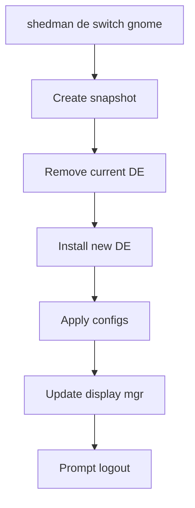

---

## 4. Configuration Commands

### `shedman config list`

List available configurations.

```bash
shedman config list
#  shedos-configs-hypr     1.0.0   [installed]
#  shedos-configs-nvim     1.0.0   [installed]
#  shedos-configs-zsh      1.0.0   [available]
```

### `shedman config diff`

Show differences between installed and default configs.

```bash
shedman config diff             # Diff all configs
shedman config diff hypr        # Diff hyprland config
```

### `shedman config apply`

Apply default configurations.

```bash
shedman config apply            # Apply all (interactive)
shedman config apply hypr       # Apply hyprland config
shedman config apply nvim -y    # Apply without prompts
```

| Flag | Description |
|------|-------------|
| `-y`, `--yes` | Skip per-file prompts |
| `--backup` | Backup existing files first |
| `--force` | Overwrite without asking |
| `--merge` | Open merge tool for conflicts |

### `shedman config reset`

Reset to default configurations.

```bash
shedman config reset hypr       # Reset to default
```

### `shedman config rollback`

Rollback to previous configuration.

```bash
shedman config rollback hypr              # Rollback to previous
shedman config rollback hypr --list       # List backups
shedman config rollback hypr <timestamp>  # Specific backup
```

---

## 5. Theme Commands

### `shedman theme list`

```bash
shedman theme list              # List all themes
shedman theme list --installed  # Show installed only
```

### `shedman theme install`

```bash
shedman theme install catppuccin-mocha
```

### `shedman theme apply`

```bash
shedman theme apply catppuccin-mocha
shedman theme apply catppuccin-mocha --preview  # Preview first
```

### `shedman theme rollback`

```bash
shedman theme rollback          # Rollback to previous
shedman theme rollback --list   # List theme history
```

---

## 6. Snapshot Commands

### `shedman snapshot create`

```bash
shedman snapshot create                    # Create snapshot
shedman snapshot create --name "pre-update"  # Named snapshot
shedman snapshot create --include-home     # Include home dir
```

### `shedman snapshot list`

```bash
shedman snapshot list           # List local snapshots
shedman snapshot list --remote  # List cloud snapshots
```

### `shedman snapshot restore`

```bash
shedman snapshot restore <id>   # Restore snapshot
shedman snapshot restore latest # Restore most recent
```

### `shedman snapshot delete`

```bash
shedman snapshot delete <id>
shedman snapshot delete --older-than 30d
```

### `shedman snapshot push`

```bash
shedman snapshot push <id>                 # Push to default remote
shedman snapshot push <id> --remote gdrive # Push to Google Drive
```

### `shedman snapshot pull`

```bash
shedman snapshot pull <id>                 # Pull from default remote
shedman snapshot pull <id> --remote gdrive # Pull from Google Drive
```

### `shedman snapshot remote`

```bash
shedman snapshot remote add gdrive    # Add Google Drive
shedman snapshot remote add r2        # Add Cloudflare R2
shedman snapshot remote add s3        # Add AWS S3
shedman snapshot remote list          # List remotes
shedman snapshot remote remove gdrive # Remove remote
shedman snapshot remote test          # Test connection
```

### `shedman snapshot disk` (USB/External Drive)

Save snapshots to USB flash drive or external disk for offline restore.

```bash
shedman snapshot disk save <id> /dev/sdb1      # Save to USB drive
shedman snapshot disk save <id> /mnt/usb       # Save to mounted path
shedman snapshot disk list /dev/sdb1           # List snapshots on disk
shedman snapshot disk restore /dev/sdb1 <id>   # Restore from disk
```

| Flag | Description |
|------|-------------|
| `--format` | Format target as ext4 first |
| `--compress` | Use zstd compression |
| `--verify` | Verify after write |

### `shedman migrate`

Import existing pacman configuration.

```bash
shedman migrate                        # Auto-import from /etc/pacman.conf
shedman migrate --from /path/to/pacman.conf
shedman migrate --dry-run              # Show what would be imported
```

---

## 7. Boot Management Commands

### `shedman boot list`

```bash
shedman boot list
#  linux 6.12.2 (current, default)
#  linux 6.12.1
#  linux-lts 6.6.10
```

### `shedman boot set-default`

```bash
shedman boot set-default linux@6.12.1  # Set default kernel
```

### `shedman boot set-oneshot`

```bash
shedman boot set-oneshot linux-lts     # Boot LTS once
```

---

## 8. Service Management Commands (svc)

### `shedman svc list`

```bash
shedman svc list docker         # List docker services
```

### `shedman svc enable/start/status`

```bash
shedman svc enable docker
shedman svc start docker
shedman svc status docker
```

---

## 9. Notifier Commands

```bash
shedman notifier enable         # Enable timer
shedman notifier disable        # Disable timer
shedman notifier check          # Manual check
shedman notifier status         # Show status
```

---

## 10. Mirror Commands

```bash
shedman mirror list             # Show all mirrors
shedman mirror test             # Test speeds
shedman mirror test --select    # Auto-select fastest
```

---

## 11. Utility Commands

### `shedman hold`

```bash
shedman hold <pkg>              # Hold package
shedman hold list               # List held packages
shedman unhold <pkg>            # Release hold
```

### `shedman export/import`

```bash
shedman export > packages.txt   # Export package list
shedman import packages.txt     # Install from list
```

### `shedman log`

```bash
shedman log                     # Recent logs
shedman log --json              # JSON output
shedman log --since 7d          # Last 7 days
```

### `shedman tui`

```bash
shedman tui                     # Launch interactive TUI
```

---

## 12. Security Commands

### `shedman keyring`

Manage GPG keys for package verification.

```bash
shedman keyring list                    # List trusted keys
shedman keyring add <keyid>             # Add key by ID
shedman keyring remove <keyid>          # Remove key
shedman keyring refresh                 # Refresh keys from keyserver
shedman keyring import <file>           # Import key from file
```

### `shedman security`

Security advisories and CVE checking.

```bash
shedman security check                  # Check installed packages for CVEs
shedman security list                   # List all known vulnerabilities
shedman security fix                    # Update vulnerable packages
shedman security report                 # Generate security report
```

| Flag | Description |
|------|-------------|
| `--json` | Output as JSON |
| `--severity <level>` | Filter by severity (low/medium/high/critical) |

---

## 13. AUR Commands

---

---

## 14. Build Commands

### `shedman build`

Build packages from PKGBUILD (Arch format only).

```bash
# Build from PKGBUILD
shedman build ./PKGBUILD                # Build → .pkg.tar.zst
shedman build ./PKGBUILD --install      # Build and install
shedman build <aur-pkg> --edit          # Edit PKGBUILD before build
```

### Local Package Install

Install from local Arch package files.

```bash
# Native Arch format only
shedman install ./package.pkg.tar.zst
shedman install ./package.pkg.tar.zst --asdeps
```

---

---

---

## 15. Completion Commands

### `shedman completion`

Generate shell completions.

```bash
shedman completion bash > /etc/bash_completion.d/shedman
shedman completion zsh > /usr/share/zsh/site-functions/_shedman
shedman completion fish > ~/.config/fish/completions/shedman.fish
```

---

# Part 2: System Architecture

## Package Source Detection

When you run `shedman install <pkg>`, shedman determines where to get the package:

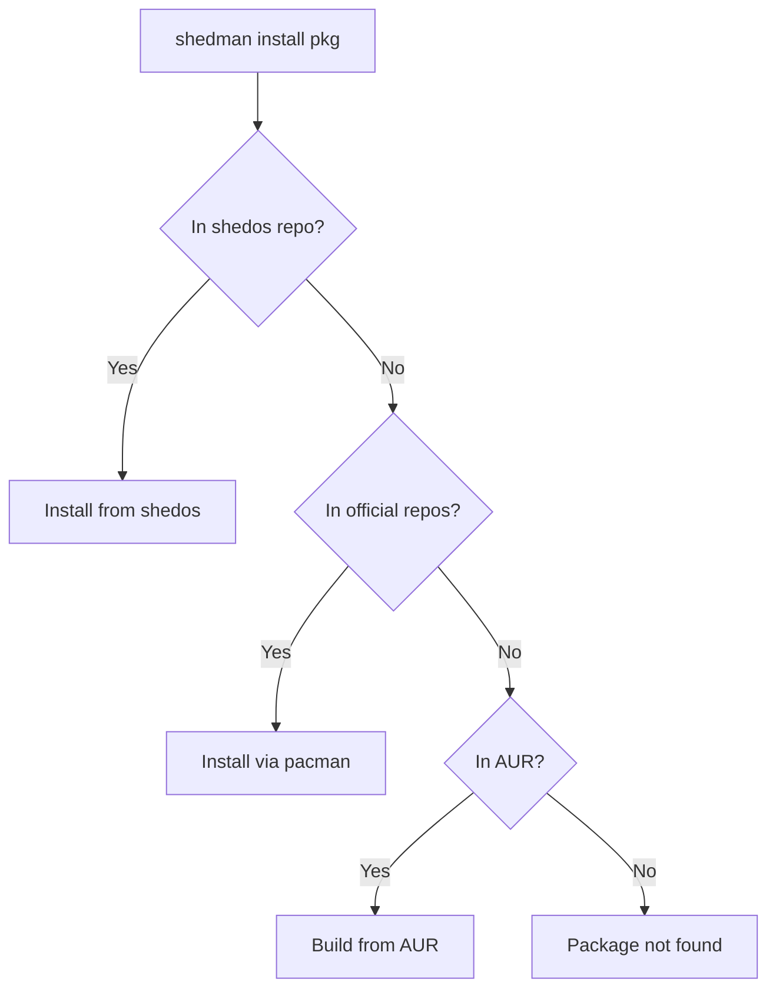

**Priority order**: shedos → official → AUR

This ensures ShedOS-optimized packages are preferred, then official Arch packages, then community AUR packages.

---

## Dependency Resolution

### How It Works

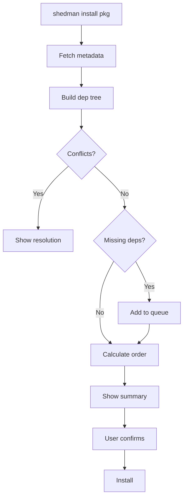

### Step-by-Step Process

1. **Parse request**: Identify package name and optional version constraint
2. **Fetch metadata**: Query shedos, official, and AUR databases
3. **Build dependency tree**: Recursively resolve all dependencies
4. **Detect conflicts**: Check for file conflicts and package conflicts BEFORE install
5. **Calculate order**: Topological sort to determine correct installation sequence
6. **Show summary**: Display packages to install, upgrade, remove, and disk space impact
7. **User confirms**: Wait for user confirmation (skip with `-y`)
8. **Install**: Execute installation in dependency order

### Dependency Features

| Feature | Description |
|---------|-------------|
| **Conflict detection** | Detects file conflicts BEFORE install |
| **Optional deps** | Shows optional dependencies, user chooses |
| **Circular deps** | Handles circular dependencies gracefully |
| **Version constraints** | Respects `>=`, `<=`, `=` version specs |
| **Provides/replaces** | Handles virtual packages |

---

## AUR Build Flow

When a package is from AUR, shedman performs a secure build process:

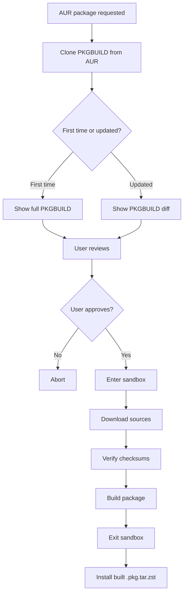

### AUR Security Features

| Feature | Description |
|---------|-------------|
| **PKGBUILD review** | Always show PKGBUILD before building (diff if updated) |
| **Sandbox** | Build in `bubblewrap` container with no network access |
| **Isolated $HOME** | Temporary home directory prevents data leakage |
| **Checksum verification** | Verify source integrity before build |
| **No root build** | Never build as root, only install as root |

### Sandbox Details

```bash
# What the sandbox restricts:
- No network access during build
- No access to real $HOME
- No access to sensitive directories
- Read-only access to /usr, /etc
- Writable temporary build directory only
```

### Example Output

```
shedman install neovim-nightly

Resolving dependencies...

 📦 Install (3):
    neovim-nightly     0.11.0-1    [aur]     45.2 MB
    tree-sitter        0.22.0-1    [official] 1.2 MB
    luajit             2.1-1       [official] 0.8 MB

 🔄 Upgrade (1):
    lua                5.4.6 → 5.4.7        [official]

 ⚠️  Conflicts:
    neovim-nightly conflicts with neovim
    → Remove neovim? [Y/n]

 📊 Total download: 47.2 MB
 📊 Net disk change: +42.1 MB

Proceed? [Y/n]
```

---

## TUI Interface

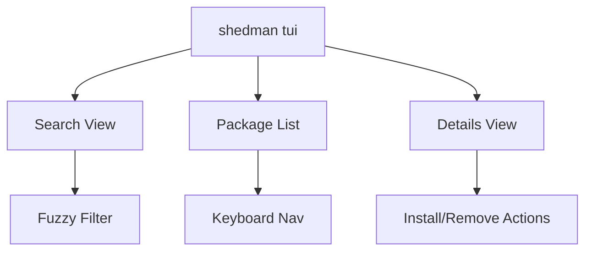

```bash
shedman tui
```

```
┌─ shedman ─────────────────────────────────────────────┐
│ 🔍 Search: neovim█                                    │
├───────────────────────────────────────────────────────┤
│ ▸ neovim             0.10.0-1   [official] installed  │
│   neovim-nightly     0.11.0-1   [aur]                 │
│   neovim-git         r12345     [aur]                 │
│   shedos-configs-nvim 1.0.0     [shedos]              │
├───────────────────────────────────────────────────────┤
│ [i]nstall  [r]emove  [u]pdate  [Enter] details  [q]uit│
└───────────────────────────────────────────────────────┘
```

Built with Go's `bubbletea` TUI library.

---

## Notifications System

### Desktop Notifications (`shedman-notifier`)

**Systemd User Timer**:

```ini
# ~/.config/systemd/user/shedman-notifier.timer
[Timer]
OnBootSec=5min
OnUnitActiveSec=6h

[Install]
WantedBy=timers.target
```

**Behavior**:

1. Timer fires every 6 hours
2. Runs `shedman sync --quiet`
3. Checks for available updates
4. If updates exist → sends notification via `notify-send`:

   ```
   🔔 ShedOS Updates Available
   5 packages can be updated.
   Run: shedman update
   ```

### MOTD (Message of the Day)

- shedman installs `/etc/profile.d/shedman-motd.sh`
- On interactive shell login, checks cache file
- Shows one-liner if updates available:

```bash
# User opens terminal:
🔔 5 updates available. Run: shedman update

user@shedos ~ $
```

**Cache**: `~/.cache/shedman/update-count`

---

## Boot Environment Management

### The Problem

- User updates kernel (e.g., `linux 6.12.1 → 6.12.2`)
- If new kernel fails to boot, user is stuck
- No easy way to boot previous kernel

### shedman Solution

**Keep Previous Kernels**:

```bash
shedman config set boot.keep-kernels 3
# Keeps last 3 kernel versions installed
```

**Integration**:

| Bootloader | Method |
|------------|--------|
| systemd-boot | Edit `/boot/loader/loader.conf` |
| GRUB | Edit `/etc/default/grub`, run `grub-mkconfig` |

**Post-Kernel-Update Hook**:

```bash
# /etc/shedman/hooks/post-install.d/kernel-snapshot.sh
if [[ "$SHEDMAN_PACKAGE" == linux* ]]; then
    shedman snapshot create "pre-kernel-$SHEDMAN_VERSION"
fi
```

### Boot Recovery Flow

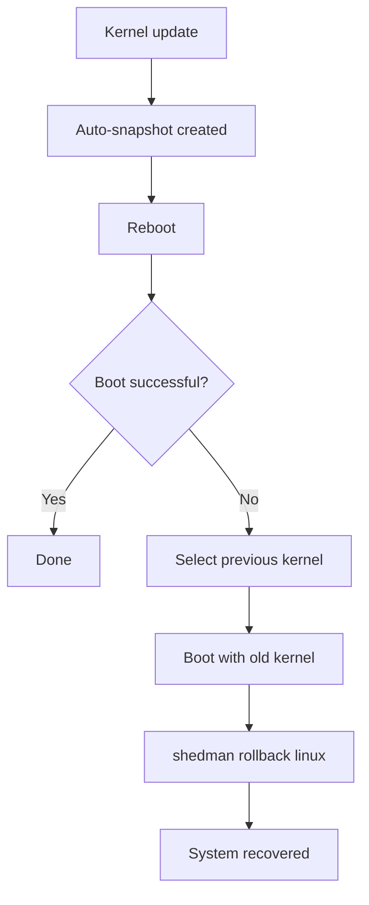

---

## Package Request System

### User Flow

1. User visits `packages.shedos.org/request`
2. Fills form (package name, URL, reason)
3. System creates GitHub Issue in shedrepo
4. Community votes with 👍 reactions
5. Maintainer reviews monthly
6. Package added to shedrepo or rejected with reason

### Request Categories

| Type | Description |
|------|-------------|
| **New package** | Package not in AUR or official |
| **Promote AUR** | Move AUR package to shedrepo (faster, signed) |
| **Config request** | Add `shedos-configs-X` for app |
| **Theme request** | Add theme package |

---

## Dotfile Conflict Resolution

### The Problem

- `shedos-configs-nvim` wants to install `init.lua`
- User already has their own `init.lua`
- What happens?

### Strategy: Never Overwrite User Files

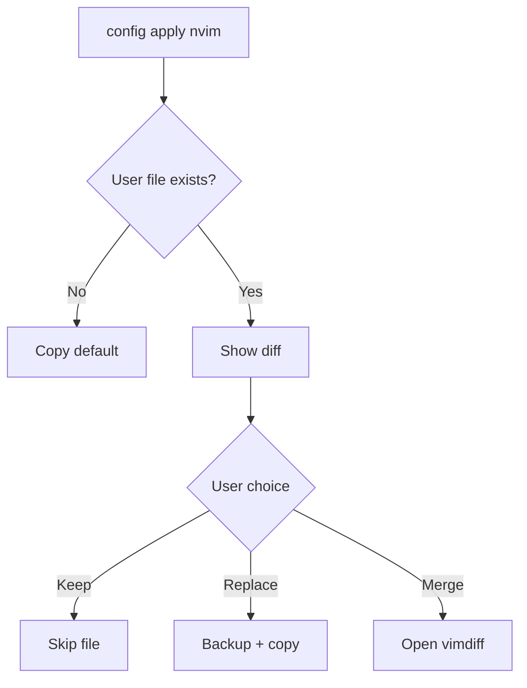

1. Check if user file exists
2. If no → copy default
3. If yes → show diff
4. User chooses: keep, replace, or merge

### Conflict UI

```
shedman config apply nvim

Checking ~/.config/nvim/init.lua...
 ⚠️  File already exists and differs from default.

--- Your version
+++ Default version
@@ -1,5 +1,5 @@
-vim.g.mapleader = ","
+vim.g.mapleader = " "
 require("plugins")

What do you want to do?
 [k] Keep my version (skip)
 [d] Use default (backup yours to ~/.config/nvim/init.lua.bak)
 [m] Merge (open vimdiff)
 [a] Apply to all files in this package
 > 
```

---

## Mirror System

### Primary CDN

```
repo.shedos.org → Cloudflare R2 (primary)
```

### Fallback Mirrors

```
# /etc/shedman/mirrors.conf
[shedos]
Server = https://repo.shedos.org/shedos/$arch
Server = https://mirror.example.com/shedos/$arch    # Community
Server = https://github-mirror.shedos.org/$arch     # GitHub fallback
```

### Geographic Distribution

- Cloudflare R2 has global edge caching
- `shedman mirror test` - test speeds, auto-select fastest
- Auto-failover if primary fails

### Mirror Failover Flow

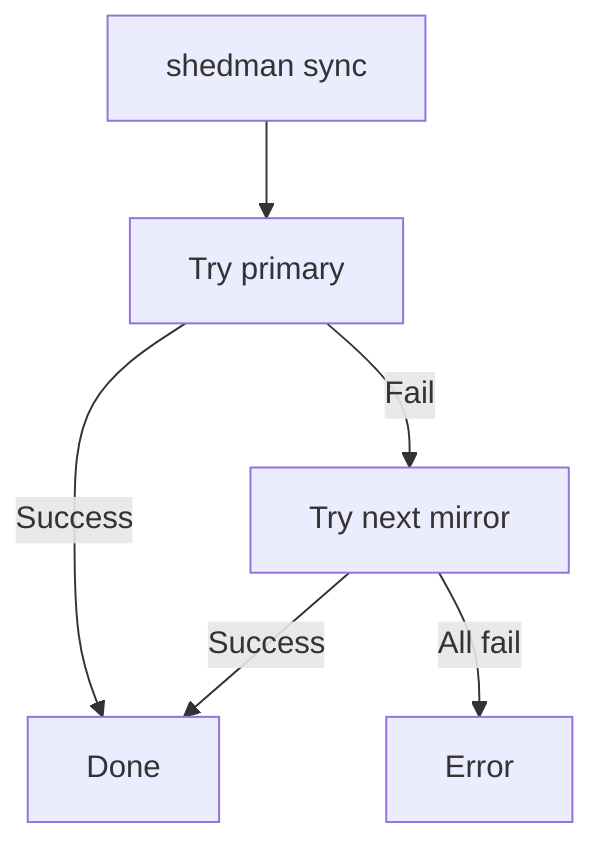

---

## Systemd Integration

### Service Management After Install

```bash
shedman install docker

 📦 Installed: docker 24.0.0

 ℹ️  This package provides systemd services:
    • docker.service (disabled)
    • docker.socket (disabled)

 Enable and start docker.service now? [y/N]
```

---

## Intelligent Snapshot System

### Filesystem Auto-Detection

| Filesystem | Method |
|------------|--------|
| btrfs | Native subvolume snapshot |
| zfs | Native dataset snapshot |
| LVM | LVM snapshot |
| ext4/xfs | rsync incremental backup |

### Cloud Providers (via rclone)

- Google Drive
- Cloudflare R2
- AWS S3
- Google Cloud Storage
- Azure Blob Storage

---

## AUR Sandboxing

- Build in `bwrap` container
- No network during build
- Temporary `$HOME`
- Show PKGBUILD diff before build

---

## Hooks System

```
/etc/shedman/hooks/
├── pre-install.d/
├── post-install.d/
├── pre-remove.d/
└── post-remove.d/
```

---

## Structured Logging & Audit Trail

### Log Locations

```
/var/log/shedman/
├── shedman.log          # Main operations log
├── transactions.log     # Install/remove history (JSON)
└── errors.log           # Errors only

~/.local/share/shedman/
└── user-transactions.log  # User-specific (AUR builds)
```

### Transaction Log Format

```json
{
  "timestamp": "2024-12-30T12:00:00Z",
  "action": "install",
  "packages": ["neovim", "tree-sitter"],
  "user": "theshedman",
  "source": "official",
  "success": true,
  "duration_ms": 4523
}
```

---

## Configuration File

Location: `~/.config/shedman/config.toml`

```toml
[general]
color = true
confirm = true

[network]
parallel_downloads = 5
timeout = 30
proxy = ""

[mirrors]
shedos = "https://repo.shedos.org/shedos/$arch"

[boot]
keep_kernels = 3

[snapshot]
auto_before_update = true
keep_local = 10
default_remote = "gdrive"

[notifications]
enabled = true
interval = "6h"
```

---

## Network Features

### Resume Interrupted Downloads

All downloads are resumable. If connection drops:

- Partial files are kept
- Next attempt continues from where it stopped
- `--retry <n>` to set retry count

### Delta Updates

Download only the difference between versions:

```bash
shedman update --delta              # Enable delta updates
```

Reduces bandwidth by ~70% for minor version updates.

### Bandwidth Limiting

```bash
shedman update --limit-rate 500K    # Limit to 500 KB/s
shedman update --limit-rate 2M      # Limit to 2 MB/s
```

Config option:

```toml
[network]
limit_rate = "1M"
```

---

## Scheduled Snapshots

### Auto-Backup Configuration

```toml
# ~/.config/shedman/config.toml
[snapshot]
auto_before_update = true           # Snapshot before every update
scheduled = true                    # Enable scheduled snapshots
schedule = "daily"                  # daily, weekly, monthly
keep_scheduled = 7                  # Keep last 7 scheduled snapshots

# Auto-upload to cloud/disk
auto_push = true
auto_push_remote = "gdrive"         # or "/dev/sdb1" for USB
```

### Commands

```bash
shedman snapshot schedule enable    # Enable scheduled snapshots
shedman snapshot schedule disable   # Disable
shedman snapshot schedule status    # Show schedule status
shedman snapshot schedule run       # Manual trigger
```

Uses systemd timer for scheduling.

---

## Snapshot Encryption

### Encrypt Before Upload

```bash
shedman snapshot push 5 --encrypt           # Encrypt with default key
shedman snapshot push 5 --encrypt --key-file ~/.ssh/backup.key
shedman snapshot pull 5 --decrypt           # Decrypt on download
```

### Key Management

```bash
shedman snapshot key generate               # Generate new key
shedman snapshot key export > backup.key    # Export key (SAVE THIS!)
shedman snapshot key import backup.key      # Import key
shedman snapshot key list                   # List known keys
```

Encryption uses `age` (modern, simple) or GPG (user choice).

### Key Recovery Strategy

> [!CAUTION]
> **If you lose your encryption key, encrypted snapshots CANNOT be recovered.**

**Best practices to prevent key loss:**

1. **Export key immediately after generation**:

   ```bash
   shedman snapshot key export > ~/backup-key.txt
   ```

2. **Store key in multiple safe locations**:
   - Password manager (1Password, Bitwarden, etc.)
   - Printed paper in a safe
   - Encrypted USB drive in a secure location
   - Trusted family member

3. **Use recovery key file on USB**:

   ```bash
   # During setup, save to USB
   shedman snapshot key export > /mnt/usb/shedman-recovery.key
   
   # After reinstall, restore from USB
   shedman snapshot key import /mnt/usb/shedman-recovery.key
   ```

**If key is lost:**

- Encrypted cloud snapshots are permanently inaccessible
- Unencrypted snapshots (USB, local) can still be restored
- You must create new snapshots with a new key

**Recommendation**: Always keep at least one unencrypted USB backup as a failsafe.

---

## Snapshot Restore Flow

Complete flow for restoring system after reinstall:

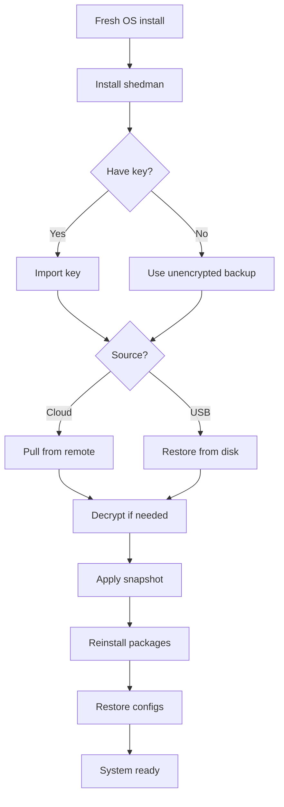

### Restore Commands

```bash
# From cloud (encrypted)
shedman snapshot key import backup.key
shedman snapshot pull 5 --remote gdrive
shedman snapshot restore 5

# From USB (unencrypted)
shedman snapshot disk restore /dev/sdb1 latest

# Selective restore
shedman snapshot restore 5 --packages-only    # Only reinstall packages
shedman snapshot restore 5 --configs-only     # Only restore configs
shedman snapshot restore 5 --home-only        # Only restore home directory
```

### Snapshot Diff

```bash
shedman snapshot diff 5 8           # Compare snapshots 5 and 8
shedman snapshot diff 5 current     # Compare snapshot 5 to current state
```

Shows: added files, removed files, modified files, package changes.

---

## API / Library Mode

shedman can be used programmatically:

```bash
shedman --json search neovim        # JSON output for scripting
shedman --api                       # Start API server mode
```

### Go Library

```go
import "github.com/theshedman/shedman/pkg/shedman"

client := shedman.New()
pkgs, _ := client.Search("neovim")
client.Install("neovim", shedman.WithConfirm(false))
```

---


---

# Part 3: Module Overview

shedman uses a **modular monorepo** architecture. Each module handles a specific concern:

## Core Modules

| Module | Responsibility | Key Commands |
|--------|----------------|--------------|
| **core** | Package management | install, remove, update, search, info |
| **snapshot** | Backup/restore | snapshot create/restore/push/pull |
| **config** | Config packages | config list/install/update |
| **de** | Desktop environments | de list/switch |
| **theme** | Theme management | theme list/install/apply |
| **boot** | Kernel/bootloader | boot list/set-default |
| **svc** | Service management | svc list/enable/start/status |
| **notifier** | Update notifications | notifier enable/disable/check |
| **mirror** | Mirror management | mirror list/test/select |
| **log** | Transaction logging | log, history |
| **tui** | Interactive UI | tui |
| **keyring** | GPG keys | keyring list/add/remove |
| **security** | CVE scanning | security check/list/fix |

## Module Interactions

All modules compose into single `shedman` binary:

```bash
shedman install pkg       # Uses core module
shedman snapshot create   # Uses snapshot module
shedman de switch gnome   # Uses de + core + config modules
shedman svc enable docker # Uses svc module
```

## Monorepo Structure

```
shedman/
├── cmd/shedman/          # Main CLI entry
├── pkg/                  # Public modules
│   ├── core/
│   ├── snapshot/
│   ├── config/
│   └── ...
└── internal/             # Shared utilities
    ├── alpm/
    ├── config/
    └── output/
```

For detailed architecture, see:

- [Modular Architecture](../architecture/modular_architecture.md)
- [Capability Interfaces](../architecture/capability_interfaces.md)
- [Architecture Decision Records](../architecture/adrs.md)
